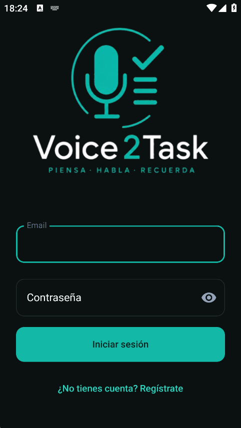
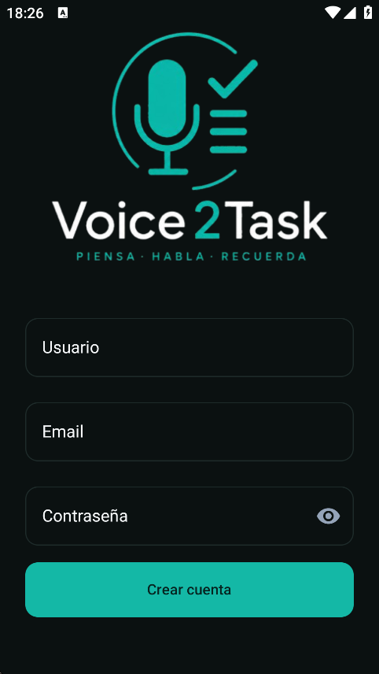
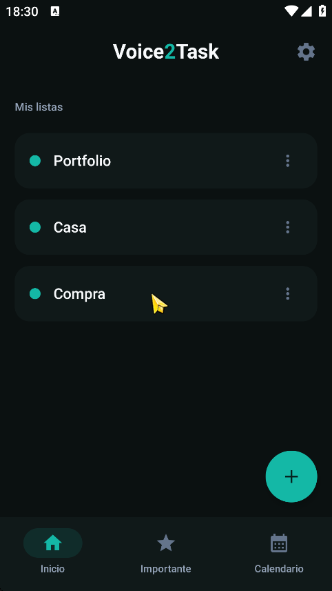
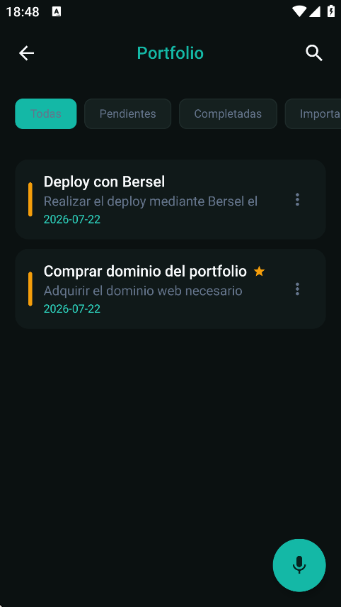
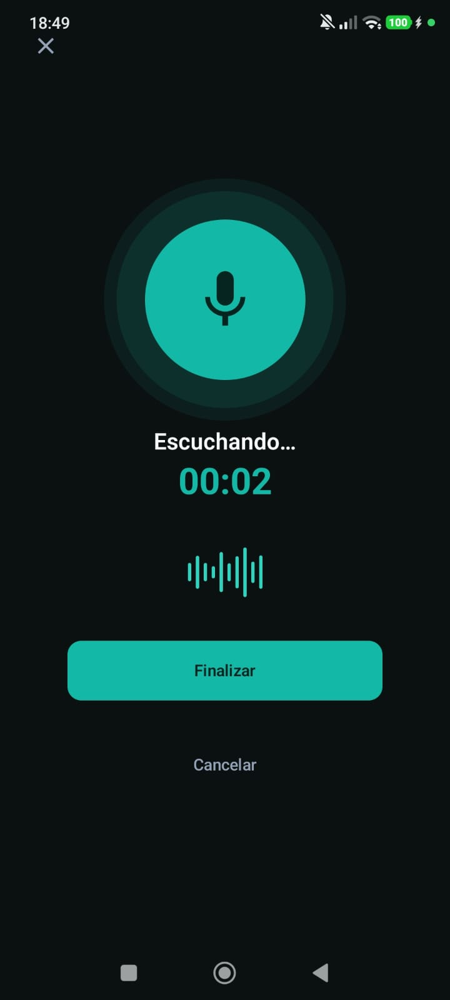
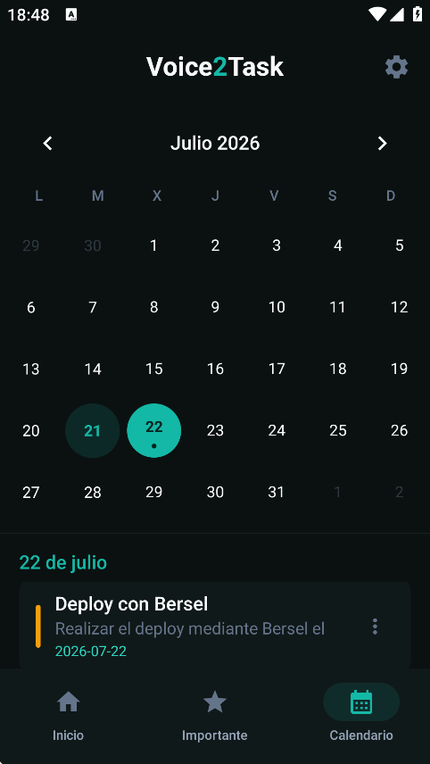
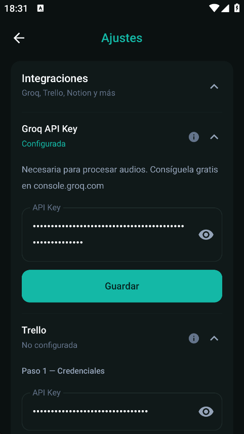
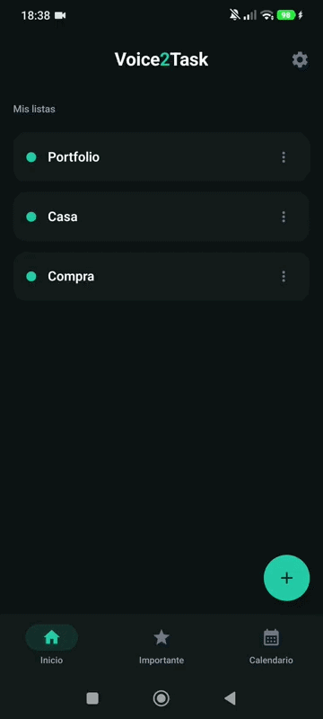
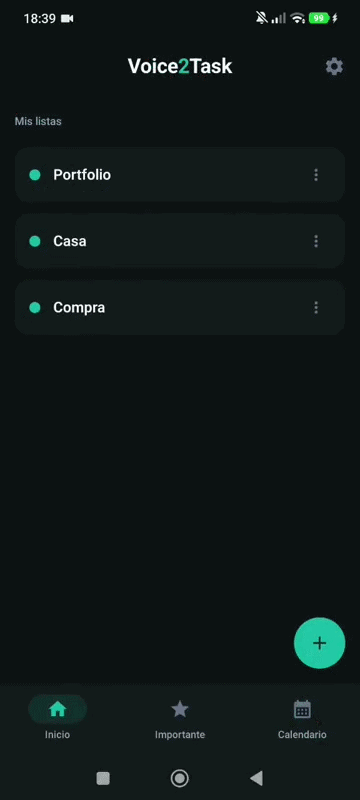
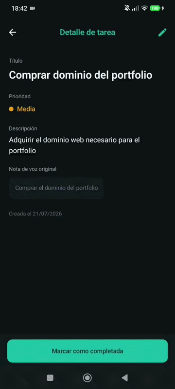

<div align="center">

# Voice2Task — Android

**App Android que convierte notas de voz en tareas estructuradas con IA**  
*Android app that converts voice notes into structured tasks using AI*

[](https://kotlinlang.org)
[](https://developer.android.com/jetpack/compose)
[](https://android.com)
[](https://github.com/ArocaDev/voice2task)

</div>

---

## ¿Qué es esto?

App Android nativa que graba una nota de voz, la envía al backend, y devuelve una tarea estructurada con título, descripción, fecha límite y prioridad — generada automáticamente por IA. La tarea se puede guardar en Voice2Task, Trello, Notion, o en los tres a la vez.

---

## 📸 Capturas

<div align="center">

| Login | Registro | Mis listas | Tareas |
|:-:|:-:|:-:|:-:|
|  |  |  |  |

| Grabando | Calendario | Integraciones |
|:-:|:-:|:-:|
|  |  |  |

</div>

---

## 🎬 Demo

**Grabación y tarea**



**Ajustes e integraciones**



**Calendario**



---

## ✨ Funcionalidades

- Grabación de voz con **MediaRecorder** en formato OGG/Opus
- Transcripción con **Groq Whisper Large V3 Turbo** vía backend
- Extracción estructurada con LLM — título, descripción, fecha límite, prioridad
- Confirmación antes de guardar — la IA no es perfecta, tú decides
- Gestión completa de tareas y listas con filtros, búsqueda y ordenación
- Calendario mensual con tareas por fecha
- Tab de importantes con estrella
- Integraciones con **Trello** y **Notion** en flujo de 3 pasos
- Auth completo con JWT y refresh tokens
- Bilingüe ES/EN

---

## 🛠️ Stack tecnológico

| Capa | Tecnología |
|------|-----------|
| Lenguaje | Kotlin 2.0 |
| UI | Jetpack Compose |
| Arquitectura | MVVM + StateFlow |
| HTTP | Retrofit |
| Persistencia local | DataStore |
| Audio | MediaRecorder (OGG/Opus) |
| Auth | JWT + refresh token interceptor |

---

## 📁 Estructura

```
app/src/main/java/com/arocadev/voice2task/
├── ui/
│   ├── screens/        # Pantallas Compose
│   └── components/     # Componentes reutilizables
├── viewmodel/          # ViewModels MVVM + StateFlow
├── data/
│   ├── repository/     # Repositorios
│   └── datastore/      # Persistencia local (tokens, ajustes)
└── network/
    ├── api/            # Interfaces Retrofit
    └── client/         # OkHttp + interceptores JWT
```

---

## 🚀 Instalación

```bash
git clone https://github.com/ArocaDev/voice2task-android
```

Abre el proyecto en **Android Studio**, configura la URL del backend en `local.properties`:

```
BASE_URL=http://tu-servidor:8000
```

Ejecuta en emulador o dispositivo físico.

Para instalar directamente la APK, descárgala desde [GitHub Releases](https://github.com/ArocaDev/voice2task-android/releases).

> El backend debe estar desplegado y accesible para que la app funcione.

---

## 🔗 Repositorios del proyecto

| Componente | Repositorio |
|---|---|
| App Android (este repo) | [voice2task-android](https://github.com/ArocaDev/voice2task-android) |
| Backend API REST | [voice2task](https://github.com/ArocaDev/voice2task) |
| Landing web | [voice2task-web](https://github.com/ArocaDev/voice2task-web) |

---

## 🗺️ Roadmap

- [x] Auth completo (JWT + refresh tokens)
- [x] Grabación y transcripción de voz
- [x] Extracción estructurada con LLM
- [x] Integraciones Trello y Notion
- [x] Calendario con tareas por fecha
- [x] APK en GitHub Releases
- [ ] Deploy del backend en Sentinel (plataforma propia)

---

## 👤 Autor

**Alejandro Rodríguez Calabuig**  
[github.com/ArocaDev](https://github.com/ArocaDev) · [LinkedIn](https://linkedin.com/in/alejandro-rodriguez-calabuig-a871a1230)

---

## 📄 Licencia

Proyecto personal en desarrollo. No licenciado para uso comercial.
